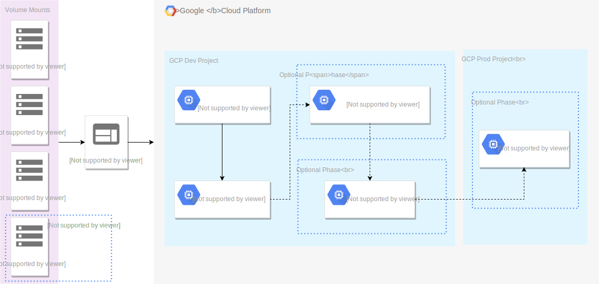

# Imagebuilder

## About

This repository hosts Imagebuilder, a tool to automate the build process of VM images for Google Cloud Platform (GCP). Imagebuilder uses Chef cookbooks and Packer to run a VM instance on GCP, install additional software, configure it and create a VM image cleaned up from user sensitive data.

For an introduction to Chef and Packer, see the documentation for [Chef](https://docs.chef.io/cookbooks.html) and [Packer](https://www.packer.io/docs/).

### Workflow diagram

<!-- Use draw.io as editor. -->



<!-- Save a diagram in SVG format with transparent background,
and don't check the "Include a copy of my diagram" option -->

## Disclaimer

This is not an officially supported Google product.

## Prerequisites

* In the GCP Console, create a service account, and download the JSON key for
  the account. For steps to create a service account, see the [IAM
  documentation](https://cloud.google.com/iam/docs/creating-managing-service-account-keys). For steps to create and download a service account's key, see [Creating and Managing Service Account Keys](https://cloud.google.com/iam/docs/creating-managing-service-account-keys).

  For detailed steps to create the service account and keys, see [Creating the Imagebuilder service account](docs/creating-service-account.md).

* Create a Google Cloud Storage (GCS) bucket to store your build logs. For steps
  to create a GCS bucket, see the [GCS documentation](https://cloud.google.com/storage/docs/creating-buckets).

## Getting Started

> NOTE: Imagebuilder currently supports Debian 9-based VM images.

### Clone this repository

```shell
git clone https://github.com/GoogleCloudPlatform/marketplace-vm-imagebuilder.git
cd marketplace-vm-imagebuilder
```

### Use the Docker image

You can build the Docker image, or pull an image from the Google Container Registry (GCR) repository.

If you want to build the `imagebuilder` container image, run the following `docker` command:

```shell
docker build -t imagebuilder .
```

If you want to pull the `imagebuilder` container image, run the following `docker` command:

```shell
docker pull gcr.io/cloud-marketplace-tools/vm/imagebuilder:0.1.2
docker tag gcr.io/cloud-marketplace-tools/vm/imagebuilder:0.1.2 imagebuilder
```

### Set the environment variables for your build environment

```shell
export KEY_FILE_PATH=<ABSOLUTE PATH FOR THE SERVICE ACCOUNT KEY>
export PROJECT=<YOUR GCP PROJECT>
export BUCKET=<GCS BUCKET NAME TO STORE BUILD LOGS>
export SOLUTION_NAME=<VM IMAGE TO BE BUILT>
```

### Run the build process

```shell
docker run \
  -v "$PWD/examples/chef:/chef:ro" \
  -v "$PWD/examples/packer:/packer:ro" \
  -v "$PWD/examples/tests:/tests:ro" \
  -v "$KEY_FILE_PATH:/service-account.json:ro" \
  -e "PROJECT=$PROJECT" \
  -e "BUCKET=$BUCKET" \
  -e "SOLUTION_NAME=$SOLUTION_NAME" \
  imagebuilder
```

For detailed information on the Docker volumes and environment variables, see
the sections below.

## Volume mounts

These are the filesystem paths used by the `imagebuilder` container image:

Path                  | Description                                                                                                                                                                                                                                                                                                                                                                | Required
--------------------- | -------------------------------------------------------------------------------------------------------------------------------------------------------------------------------------------------------------------------------------------------------------------------------------------------------------------------------------------------------------------------- | --------
/packer               | Packer templates that specify the configuration for the VM image.<br/><br/>The volume must contain a `templates` directory. Your template must be in a subdirectory that matches the `$SOLUTION_NAME` environment variable. The template is expanded with the [`packergen.py`](scripts/packergen.py) script.                                                               | Yes
/chef                 | Chef cookbooks used in the build process.<br/><br/>The volume must contain a `cookbooks` directory. Your cookbook must be in its own subdirectory. You specify the name of your cookbook in your Packer template's [`run_list` attribute](examples/packer/templates/sample-app/packer.in.json#L4).                                                                         | Yes
/tests                | A directory with test specs. The directory must contain an executable Bash script called `run-tests-on-instance.sh`, which is used as an entrypoint. <br/><br/>The `run-tests-on-instance.sh` script has access to the `$PACKER_SSH_USERNAME` and `$SOLUTION_NAME` variables. The return code of this script should indicate the result of tests: for success, return `0`. | No
/service-account.json | The JSON key for the GCP service account that you created.<br/><br/> The key is used to set an authentication context for `gcloud` commands and the `packer` binary for managing resources in your GCP project.                                                                                                                                                            | Yes

## Environment variables

The following environment variables are **required**:

-   `SOLUTION_NAME`:

    The VM image to be built. The name must be the same as the folder that has your Packer template.

-   `PROJECT`:

    A GCP project where VM instances will be created and VM image will be built.

-   `BUCKET`:

    A GCS bucket that stores the logs generated by the instance's shutdown
    script. Packer uses the log to verify that the shutdown script ran
    successfully. At the end of the build process, the log is deleted.

The following environment variables are **optional**:

-   `KEY_FILE_PATH` (defaults to `/service-account.json`):

    An absolute path of the GCP service account JSON key to used by the `gcloud`
    CLI and the `packer` binary.

-   `ZONE` (defaults to `us-central1-f`):

    The GCP zone in which the VM instance is created. The VM instance is used as
    the base for creating the image.

    For a list of zones, see [Regions and Zones in the Compute Engine documentation](https://cloud.google.com/compute/docs/regions-zones/)

-   `IMAGE_NAME` (defaults to `$SOLUTION_NAME-v$(($(date +%s%N)/1000000))`):

    An image name to be built and saved in your GCP project.

-   `PACKER_DIR` (defaults to `/packer/templates`):

    An absolute path to the Packer templates directory. A directory of
    `$SOLUTION_NAME` should be present there.

-   `CHEF_DIR` (defaults to `/chef`):

    The absolute path to the Chef cookbooks directory.

-   `TESTS_DIR` (defaults to `/tests`):

    The absolute path to the image tests directory. The directory must contain an executable
    Bash script called `run-tests-on-instance.sh`. Used when the
    `$RUN_TESTS` variable is `true`.

-   `RUN_TESTS` (`true` or `false`; defaults to `false`):

    Whether tests should be run on the newly-built VM image.

-   `ATTACH_LICENSE` (`true` or `false`; defaults to `false`):

    Whether to attach a GCP Marketplace license to the newly-built VM image. The
    license name must be provided in the solution package template.

-   `LICENSE_PROJECT_NAME` (defaults to `none`):

    A GCP project where the license was created. Required if `$ATTACH_LICENSE`
    is set to `true`.

-   `USE_INTERNAL_IP` (`true` or `false`; defaults to `false`):

    Whether to use an internal IP to configure SSH connection to instances
    created by `imagebuilder`. If `false`, then an external IP is used.

-   `PUBLISH_TO_PROJECT` (defaults to `none`):

    The name of a GCP project to copy the VM image to. The image is created in
    the project you specific in `$PROJECT`, and then copied to `$PUBLISH_TO_PROJECT`.

-   `TESTS_CUSTOM_METADATA` (defaults to `none`):

    Custom metadata for the test instance. Each metadata entry is a key/value pair
    separated by an equals sign. You can use multiple metadata keys, separated
    by a comma.

    For example:

    ```
    TESTS_CUSTOM_METADATA='google-monitoring-enable=1,google-logging-enable=1'
    ```

    For detailed information on using instance metadata, see the [Compute Engine
    documentation](https://cloud.google.com/compute/docs/storing-retrieving-metadata).

## Packer template

A Packer template is a JSON file that supports the following attributes:

Attribute             | Type   | Required
--------------------- | ------ | --------
`chef`                | dict   | Yes
`image_family`        | string | No
`license`             | string | No
`source_image_family` | string | Yes

For example:

```json
{
  "license": "imagebuilder-test",
  "source_image_family": "debian-9",
  "chef": {
    "run_list": [ "sample-app" ]
  }
}
```
